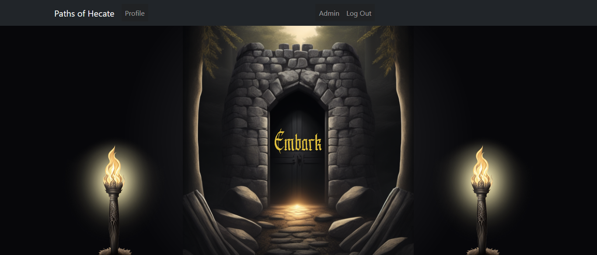
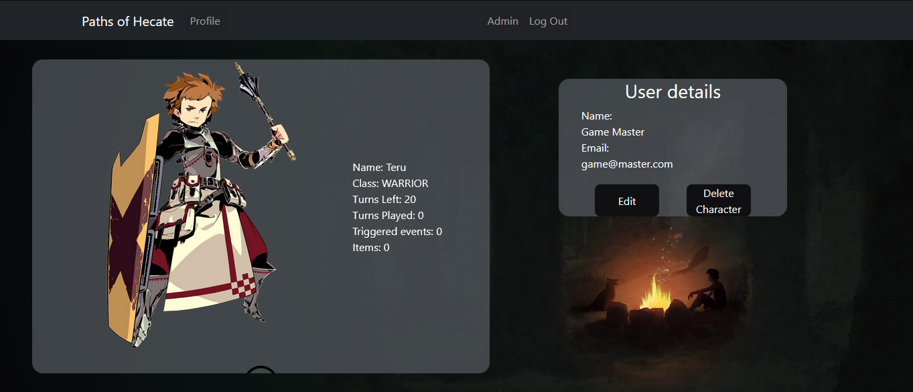
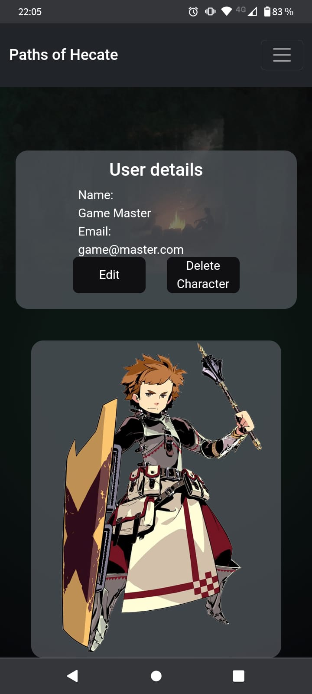
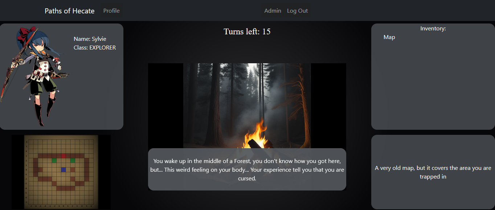

# Proyecto Final: Paths of Hecate (Front)

Proyecto final para GeeksHub Academy.

El objetivo de este projecto es demostrar todas las habilidades que he aprendido a lo largo del bootcamp, y, en este caso, he decidido hacerlo mediante un juego.

## Tecnologías:

Se ha realizado con React, Redux, Bootstrap y NodeJS. 

 ### Estructura:

La web cuenta con una estructura basica, una pagina de Home con unas puertas a las que solo podremos acceder una vez que iniciemos sesion en la pagina. Con la sesion iniciada, tenemos la opcion de entrar a nuestro perfil, donde podemos ver y crear personajes que usaremos durante el juego, y, por supuesto, tenemos la opcion de embarcarnos en el juego.

 * ### Responsive:
 
La estructura de la pagina fue creada con CSS y Bootstrap, haciendo que se adapte al tamaño de la pantalla del usuario, ya sea un Monitor o la pantalla de un telefono.

 

 * ### GameScreen:
 
 Lo principal de esta pagina es, por supuesto, el juego. Una vez que accedes a travez de las puertas, puedes escoger entre todos tus personajes para empezar la partida, y si no tienes ninguno, tendras la opcion de crearlo.

 Una vez dentro, podremos ver a nuestro personaje, sus caracteristicas, el mapa del juego (Si es que lo tienes), el inventario y la descripcion de los objetos que encontremos, todo rodeando la pantalla del juego. El juego sigue un estilo similar a una novela visual, cambiando la imagen del lugar en el que nos encontramos dependiendo de la direccion que decidamos tomar, y, ademas, tambien tiene ciertos elementos de un "Dungeon crawler", permitiendonos explorar el mapa con total libertar.

 

 Podras escapar del bosque antes de que la maldicion te consuma?

 
 
 
